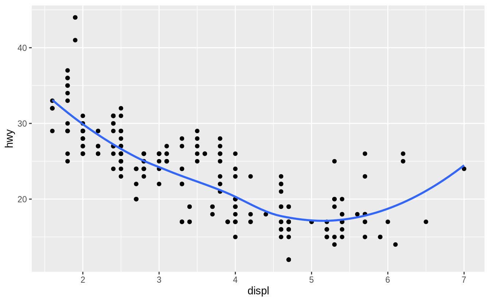
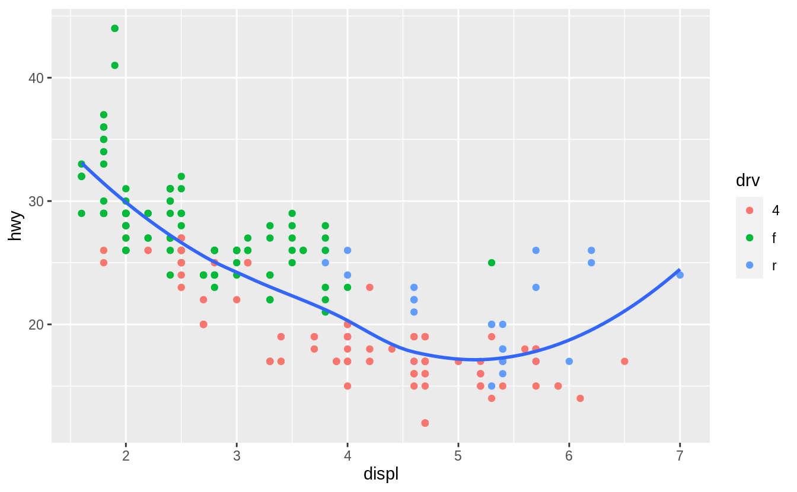
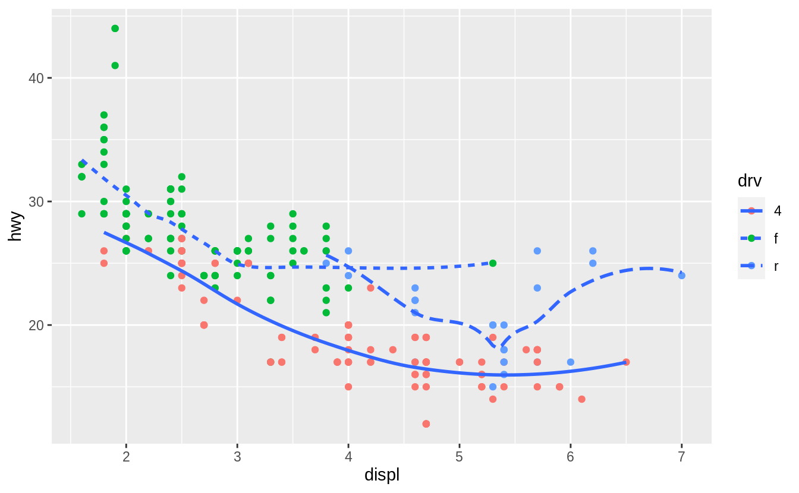
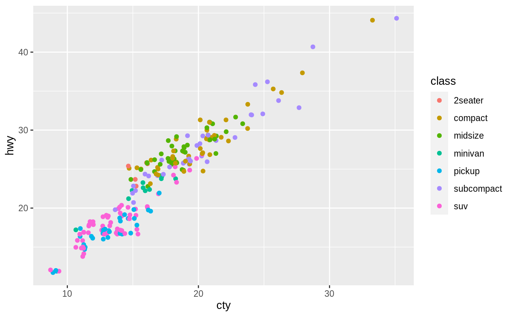
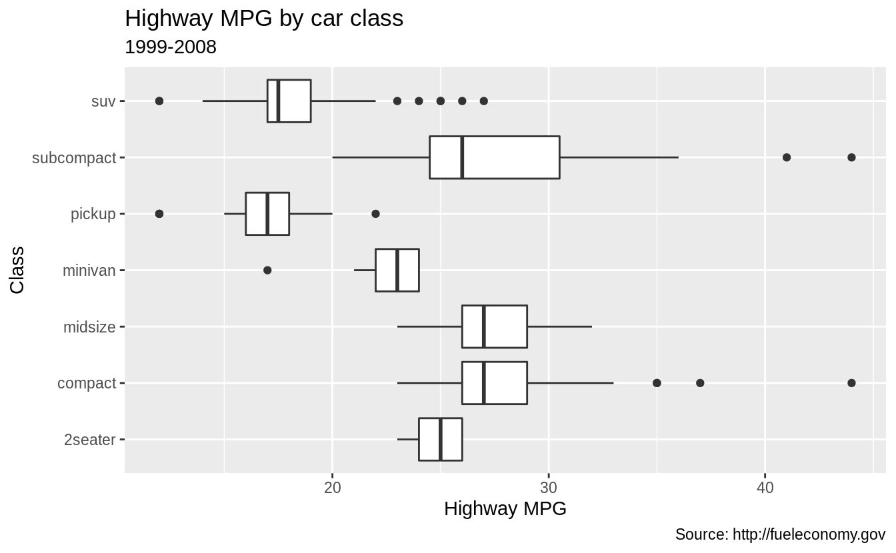
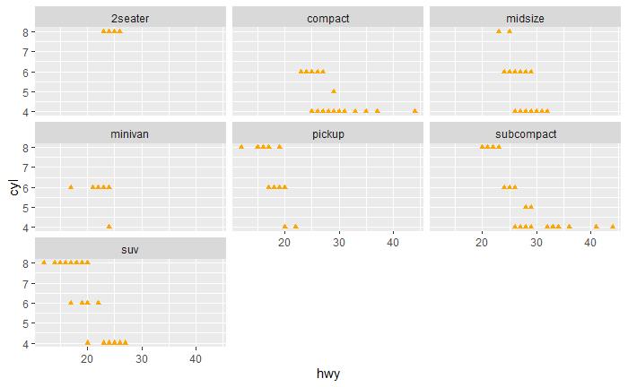

```{r setup, include=FALSE}
# Turn off messages and warnings:
knitr::opts_chunk$set(message = FALSE, warning = FALSE)

# Load `ggplot2`:
library(ggplot2)
```

## Question 1

This is the graph we need to reproduce:

```{r question-1, echo=FALSE, out.width="75%", out.height="75%"}

```

Here's how I recreate this plot:

```{r question-1-response, out.width="75%", out.height="75%"}
# Plot data from `mpg`. x-axis corresponds to `displ`, and y-axis corresponds
# to `hwy`.
plot_1 <- ggplot(mpg, aes(x = displ, y = hwy))

# Create scatter plot.
plot_1 <- plot_1 + geom_point()

# Add smooth curve. Hide confidence interval.
plot_1 <- plot_1 + geom_smooth(se = FALSE)

# Show plot.
plot_1
```

## Question 2

This is the graph we need to reproduce:

```{r question-2, echo=FALSE, out.width="75%", out.height="75%"}

```

Here's how I recreate this plot:

```{r question-2-response, out.width="75%", out.height="75%"}
# Plot data from `mpg`. x-axis corresponds to `displ`, and y-axis corresponds
# to `hwy`.
plot_2 <- ggplot(mpg, aes(x = displ, y = hwy))

# Create scatter plot. Points will be colored according to `drv`.
plot_2 <- plot_2 + geom_point(aes(color = drv))

# Add smooth curve. Hide confidence interval.
plot_2 <- plot_2 + geom_smooth(se = FALSE)

# Show plot.
plot_2
```

## Question 3

This is the graph we need to reproduce:

```{r question-3, echo=FALSE, out.width="75%", out.height="75%"}

```

Here's how I recreate this plot:

```{r question-3-response, out.width="75%", out.height="75%"}
# Plot data from `mpg`. x-axis corresponds to `displ`, and y-axis corresponds
# to `hwy`.
plot_3 <- ggplot(mpg, aes(x = displ, y = hwy))

# Create scatter plot. Points will be colored according to `drv`.
plot_3 <- plot_3 + geom_point(aes(color = drv))

# Add smooth curve. Hide confidence interval. Use different line types for
# different values of `drv`.
plot_3 <- plot_3 + geom_smooth(aes(linetype = drv), se = FALSE)

# Show plot.
plot_3
```

## Question 4

This is the graph we need to reproduce:

```{r question-4, echo=FALSE, out.width="75%", out.height="75%"}

```

Here's how I recreate this plot:

```{r question-4-response, out.width="75%", out.height="75%"}
# Plot data from `mpg`. x-axis corresponds to `cty`, and y-axis corresponds to
# `hwy`.
plot_4 <- ggplot(mpg, aes(x = cty, y = hwy))

# Create scatter plot. Points will be colored according to `class`. Set
# position to "jitter".
plot_4 <- plot_4 + geom_point(aes(color = class), position = "jitter")

# Show plot.
plot_4
```

Notice that my figure isn't identical to the one we were given. This is
expected. When we use `position = "jitter"`, a small amount of **random**
variation is added to the location of each point. Due to this randomness, it's
not possible to reproduce the original graph exactly.

## Question 5

**PLEASE READ:**\
There are two versions of this question. To be sure, I'll solve both versions
of the problem.

### Version 1

This is the graph we need to reproduce:

```{r question-5-version-1, echo=FALSE, out.width="75%", out.height="75%"}

```

Here's how I recreate this plot:

```{r question-5-version-1-response, out.width="75%", out.height="75%"}
# Plot data from `mpg`. x-axis corresponds to `hwy`, and y-axis corresponds to
# `class`.
plot_5 <- ggplot(mpg, aes(x = hwy, y = class))

# Create boxplots.
plot_5 <- plot_5 + geom_boxplot()

# Add labels.
plot_5 <- plot_5 + labs(
  x = "Highway MPG",
  y = "Class",
  title = "Highway MPG by car class",
  subtitle = "1999-2008",
  caption = "Source: http://fueleconomy.gov"
)

# Show plot.
plot_5
```

### Version 2

This is the graph we need to reproduce:

```{r question-5-version-2, echo=FALSE, out.width="75%", out.height="75%"}

```

Here's how I recreate this plot:

```{r question-5-version-2-response, out.width="75%", out.height="75%"}
# Plot data from `mpg`. x-axis corresponds to `hwy`, and y-axis corresponds to
# `cyl`.
plot_5 <- ggplot(mpg, aes(x = hwy, y = cyl))

# Create scatter plot. Points will be represented by orange triangles.
plot_5 <- plot_5 + geom_point(shape = 24, color = "orange", fill = "orange")

# Create a panel for every value of `class`.
plot_5 <- plot_5 + facet_wrap(vars(class))

# Show plot.
plot_5
```
